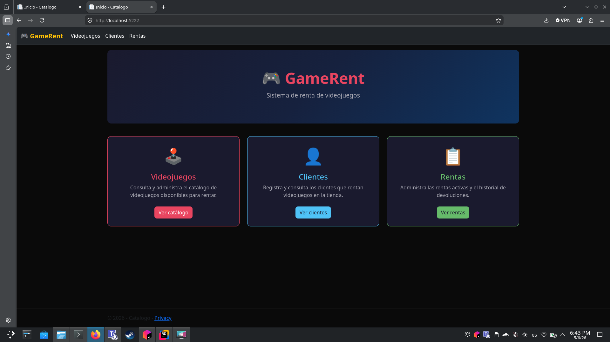
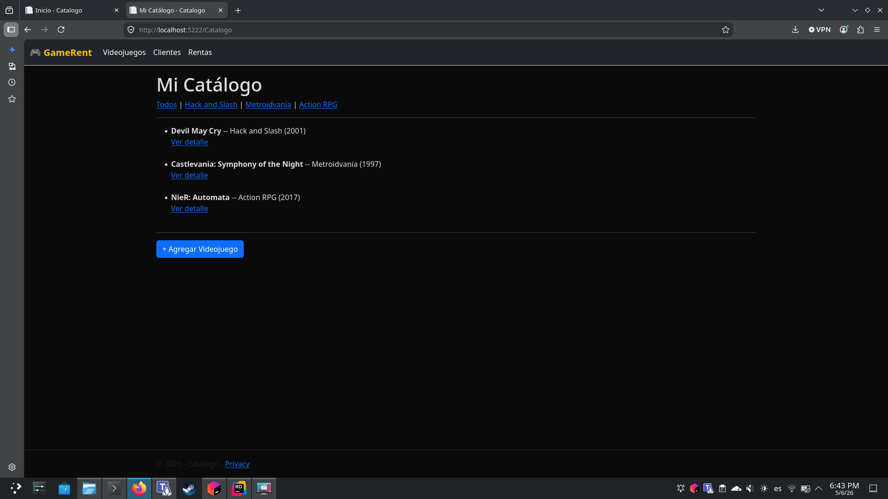
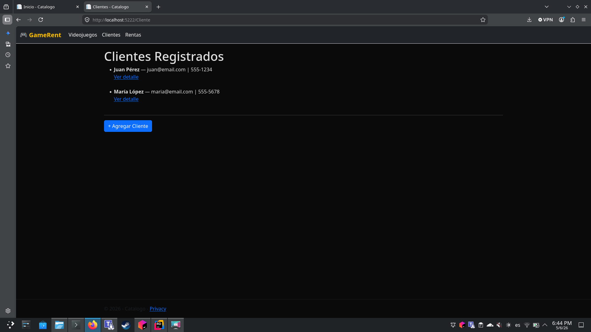
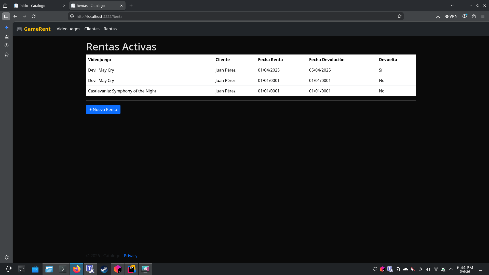

# 🎮 GameRent — Sistema de Renta de Videojuegos

GameRent es una aplicación web para administrar la renta de videojuegos en una tienda. Permite gestionar el catálogo de títulos disponibles, registrar clientes y llevar el control de las rentas activas y devoluciones.

---

## Tecnologías utilizadas

| Tecnología | Descripción |
|---|---|
| **ASP.NET Core MVC (.NET 10)** | Framework principal del backend |
| **C#** | Lenguaje de programación |
| **Razor Views (.cshtml)** | Motor de plantillas para el frontend |
| **Bootstrap 5** | Estilos y componentes UI responsivos |
| **jQuery** | Manipulación del DOM y validaciones |
| **jquery-validation** | Validación de formularios del lado del cliente |

La arquitectura sigue el patrón **MVC (Model-View-Controller)** con almacenamiento en memoria.

---

## Funcionalidades

- **Videojuegos** — Consulta y administra el catálogo. Filtra por género, ve el detalle de cada título y agrega nuevos juegos.
- **Clientes** — Registra y consulta los clientes de la tienda con nombre, email y teléfono.
- **Rentas** — Crea nuevas rentas, visualiza las activas y registra devoluciones.

---

## Capturas de pantalla

### Página principal


### Catálogo de videojuegos


### Clientes registrados


### Rentas activas


---

## Estructura del proyecto

```
Catalogo/
├── Controllers/
│   ├── HomeController.cs
│   ├── CatalogoController.cs
│   ├── ClienteController.cs
│   └── RentaController.cs
├── Models/
│   ├── Item.cs          # Modelo de videojuego
│   ├── Cliente.cs       # Modelo de cliente
│   └── Renta.cs         # Modelo de renta
├── Views/
│   ├── Catalogo/
│   ├── Cliente/
│   ├── Renta/
│   └── Shared/
├── wwwroot/             # Archivos estáticos (CSS, JS, Bootstrap)
└── Program.cs
```

---

## Cómo ejecutar

1. Asegúrate de tener instalado el [SDK de .NET 10](https://dotnet.microsoft.com/download).
2. Clona el repositorio:
   ```bash
   git clone https://github.com/Cab5ter/ArqSoft-S01-LeonardoB.git
   cd ArqSoft-S01-LeonardoB
   ```
3. Ejecuta la aplicación:
   ```bash
   dotnet run
   ```
4. Abre tu navegador en `http://localhost:5222`.

---

© 2026 - GameRent
